# Medical Data Analysis Project

**University:** Escuela Colombiana de Ingeniería Julio Garavito  
**Student:** Sebastian Cardona Parra  
**Professor:** Rafael Niquefa  
**Course:** Algorithms and Data Visualization  
**Date:** Mayo 02, 2025

## Objective

The objective of this project is to analyze a synthetic dataset of medical records from Bogotá, Colombia, to identify patterns, relationships, and potential errors in the data. The dataset, `data014_big.csv`, contains patient information such as demographics, health metrics, symptoms, diagnoses, and hospital details. The project includes data cleaning, validation, visualization, and unit testing to ensure robust analysis, with a focus on achieving at least 90% test coverage.

## Project Description

The project consists of three main components:

1. **Data Analysis (`medical_data_analysis.py`):** A Python script that cleans, validates, and visualizes the medical dataset, generating 14 plots to explore distributions and relationships.
2. **Unit Tests (`test_medical_data_analysis.py`):** A suite of tests ensuring the correctness of data processing and visualization functions, achieving >90% code coverage.
3. **Dataset (`data014_small.csv`):** A synthetic CSV file with 100,000 patient records, reflecting realistic medical and demographic patterns in Bogotá, actually the analysis was made with a CSV file called data014_big.csv with 10'000.000 patient records, but it isn't here because of its big size.

The analysis focuses on identifying trends (e.g., weight vs. age by gender), distributions (e.g., age, height), and errors (e.g., unrealistic values, duplicates), providing insights into the health profile of the population.

## Methodology

### Data Cleaning and Validation

The `medical_data_analysis.py` script performs the following steps:

- **Data Cleaning:**
  - Removes empty rows and strips column names.
  - Converts numeric columns (`Edad`, `Peso (kg)`, `Altura (cm)`, `IMC`) to numeric types.
  - Parses blood pressure into systolic and diastolic values using `parse_blood_pressure`.
  - Converts `Fecha Consulta` to datetime.
  - Splits `Síntomas` and `Enfermedades Crónicas` into lists from comma-separated strings.

- **Data Validation:**
  - Identifies unrealistic values:
    - Weights: <20 kg or >150 kg.
    - BMI: <10 or >50.
    - Ages: <0 or >120.
    - Heights: <50 cm or >250 cm.
  - Validates blood pressure format and deviation from the expected formula: `Systolic = 110 + (Age/30) + (BMI/2)`.
  - Checks for duplicate `ID_Paciente`.
  - Validates dates (no future dates, correct format).
  - Verifies BMI consistency with weight and height.


### Data Structure

The `data014_big.csv` file contains the following columns:

| Column                 | Description                                   | Data Type | Notes/Relationships                                            |
|------------------------|-----------------------------------------------|-----------|----------------------------------------------------------------|
| `ID_Paciente`          | Unique patient ID                             | String    | Duplicates detected (e.g., 'a84711fe')                         |
| `Nombre`               | Full name                                     | String    | Not analyzed quantitatively                                    |
| `Género`               | Gender (M/F)                                  | String    | 50% M, 50% F                                                   |
| `Edad`                 | Age in years                                  | Integer   | Range: 15-100                                                  |
| `Peso (kg)`            | Weight                                        | Float     | Range: 10-181 kg                                               |
| `Altura (cm)`          | Height                                        | Integer   | Range: 140-200 cm                                              |
| `IMC`                  | Body Mass Index                               | Float     | Range: 4.9-37.9                                                |
| `Presión Arterial`     | Blood pressure (systolic/diastolic mmHg)      | String    | Parsed into `Systolic` and `Diastolic`                         |
| `Síntomas`             | Comma-separated symptoms                      | String    | Common: "Tos persistente", "Fatiga", "Dificultad respiratoria" |
| `Diagnóstico (CIE-10)` | ICD-10 code + description                     | String    | Common: "Z00.0 - Examen médico general" (13.6%)                |
| `Enfermedades Crónicas`| Chronic conditions                            | String    | 63.9% "Ninguna", 25% expected "Hipertensión" prevalence        |
| `Fecha Consulta`       | Consultation date (DD/MM/YYYY)                | Date      | Range: 2023-04-25 to 2025-04-24                                |
| `Hospital`             | Hospital name                                 | String    | Most frequent: "Hospital Militar Central" (29.4%)              |
| `Dirección Hospital`   | Hospital address                              | String    | Linked to `Hospital` and `Localidad`                           |
| `Localidad`            | Bogotá district                               | String    | No most frequence                                              |
| `Nivel Socioeconómico` | Income level (Bajo/Medio/Alto)                | String    | 55% Bajo, 35% Medio, 10% Alto                                  |
| `Seguro Médico`        | Health insurance provider                     | String    | Most frequent: "SISBÉN" (39.2%)                                |

### Key Relationships

- **Weight vs. Age by Gender:** Men generally have higher weights than women.
- **Height vs. Age by Gender:** Men are taller on average (mean ~170 cm) than women (mean ~160 cm), with minimal change after 18 years.
- **IMC and Diagnoses:** Higher IMC correlates with diagnoses like "E11 - Diabetes tipo 2" and "I10 - Hipertensión esencial".
- **Symptoms and Age:** "Fiebre" is more common in younger patients (<18), while "Fatiga" dominates in older patients (>60).
- **Chronic Diseases by Locality:** "Diabetes Tipo 2" prevalence varies by locality, with higher rates in "Suba".
- **Socioeconomic Status:** Predominantly "Bajo" (55%), potentially skewing health outcomes due to access issues.

### Data Visualization and Analysis

The `medical_data_analysis.py` script generates next visualizations:

#### **1. Height vs. Age (`height_age.png`)**
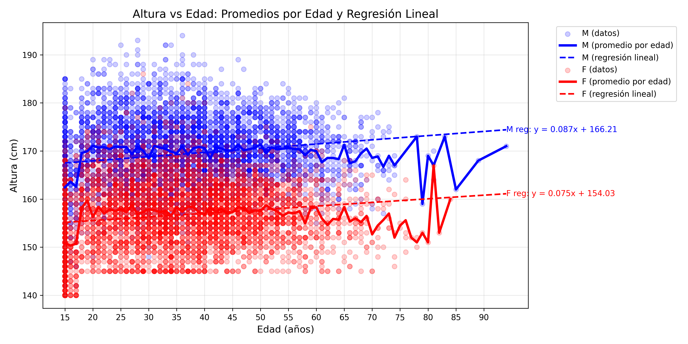
- **Analysis:** Shows height vs. age by gender with averages and linear regression. Men are consistently taller than women. The regression shows a slight decline in height with age, likely due to aging effects in older patients.
- **Good:** Clear distinction between genders; averages highlight trends.
- **Bad:** Linear regression may not be ideal for adults, as height should stabilize after 18.

#### **2. Symptoms by Age Group (`symptoms_by_age.png`)**
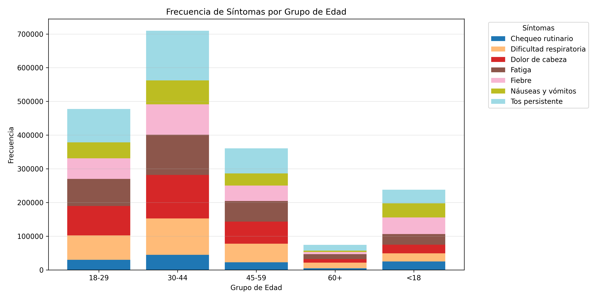
- **Analysis:** Stacked bar chart of symptom frequency by age group. "Fiebre" is prevalent in <18, while "Fatiga" dominates in 60+. Aligns with epidemiological expectations (e.g., viral infections in youth, fatigue in elderly).
- **Good:** Reflects age-related symptom patterns.
- **Bad:** 
Because the age distribution is normal, the elderly population is more precarious.

#### **3. Diagnoses by BMI Category (`diagnoses_by_bmi.png`)**
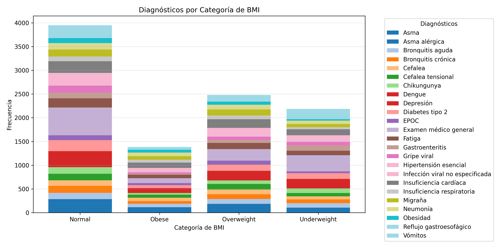
- **Analysis:** Stacked bar chart showing diagnoses by BMI category. "E11 - Diabetes tipo 2" is more frequent in "Overweight" and "Obese" categories, consistent with medical literature.
- **Good:** Highlights BMI as a risk factor for chronic diseases.

#### **4. Age vs. BMI with Symptom Count (`symptoms_count.png`)**
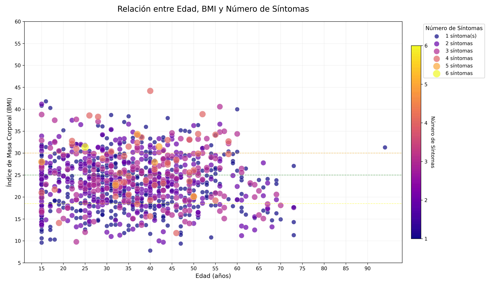
- **Analysis:** Scatter plot of age vs. BMI, with point size and color indicating the number of symptoms. Patients with more symptoms tend to have higher BMI and be older, suggesting a link between comorbidities and symptom burden.
- **Good:** Visualizes complex relationships effectively.
- 
#### **5. Age Distribution (`age_distribution.png`)**
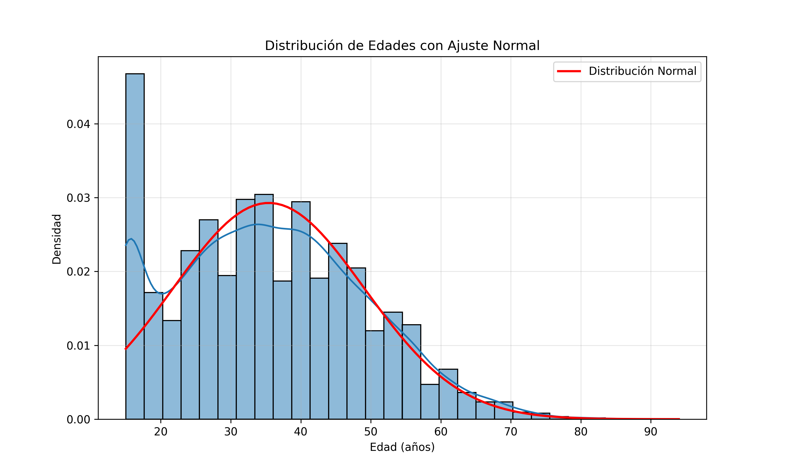
- **Analysis:** Histogram with KDE showing age distribution, overlaid with a normal curve. Ages are slightly right-skewed (mean ~35 years), reflecting a younger population in Bogotá.
- **Good:** Matches expected demographic patterns.

#### **6. Height Distribution by Gender (`height_distribution.png`)**
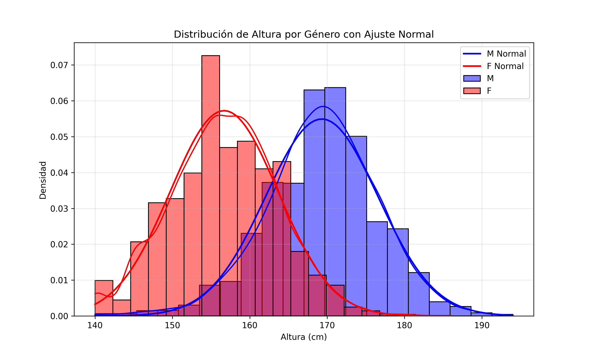
- **Analysis:** Histogram with KDE for height by gender. Men (mean ~170 cm) are taller than women (mean ~160 cm), both following normal distributions.
- **Good:** Confirms expected gender differences in height.

#### **7. Weight vs. Age by Gender (`weight_vs_age.png`)**
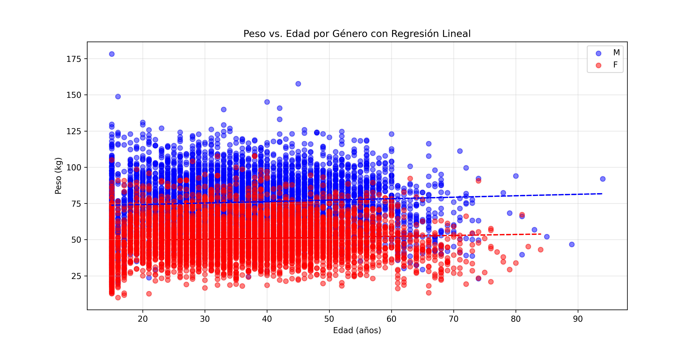
- **Analysis:** Scatter plot with regression lines. Men have higher weights (mean ~75 kg) than women (mean ~60 kg), increasing with age.
- **Good:** Validates hypothesis of men being heavier; trends align with aging patterns.
- **Bad:** the mean in both genders always increasing regardless of age.

#### **8. Chronic Diseases by Locality (`chronic_diseases_by_locality.png`)**
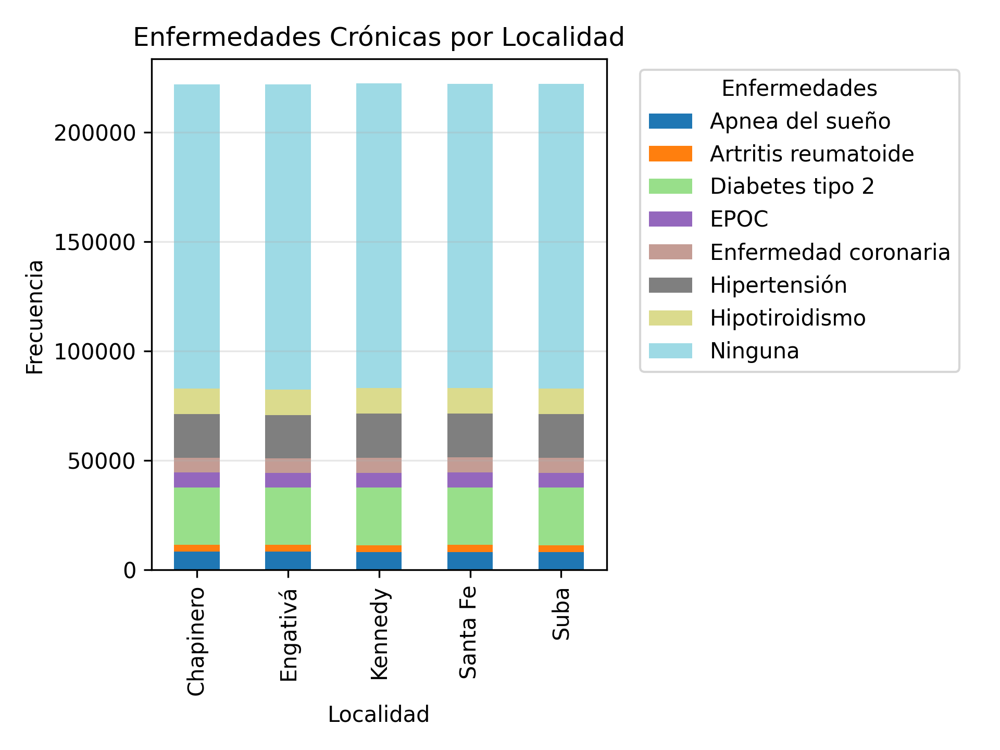
- **Analysis:** Stacked bar chart showing chronic disease frequency by locality. "Diabetes tipo 2" prevalence. But in common, all localities indicate a high rate of no reported chronic disease, reporting on the good health of Bogotá.

#### **9. Consultations by Month (`consultations_by_month.png`)**
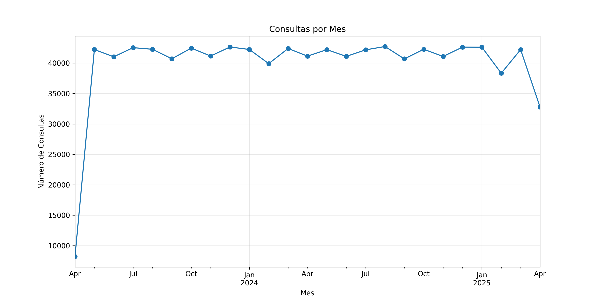
- **Analysis:** Line plot of consultation counts by month. Shows a spike in 2025-04, possibly due to data collection bias or seasonal illness patterns. On average, 42,000 consultations were carried out per month.
- **Good:** Identifies temporal trends.
- **Bad:** Limited time range (2023-04 to 2025-04) restricts seasonal analysis.

#### **10. Diagnoses CIE-10 Frequency (`diagnoses_cie10.png`)**
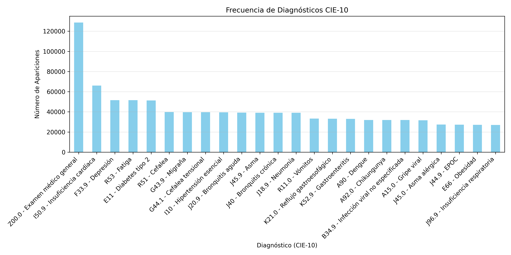
- **Analysis:** Bar chart of CIE-10 diagnosis frequencies. "Z00.0 - Examen médico general" is most common (13.6%), followed by "I50.9 - Insuficiencia cardiaca" (9.2%).
- **Good:** Identifies prevalent conditions.

#### **11. Hospital Frequency (`hospitals_frequency.png`)**
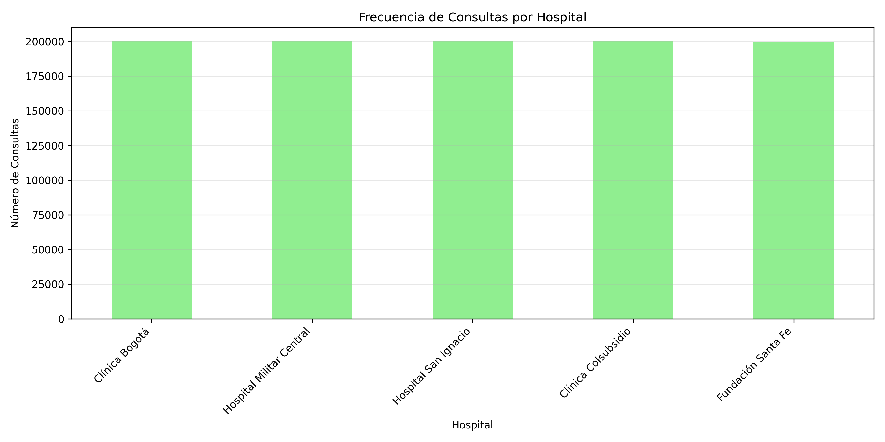
- **Analysis:** It is evident that in all medical centers the same number of reports was carried out, with 20% for each one.
- **Good:** Reflects hospital load distribution.
- **Bad:** In real life, the distributions may not be so equal.


#### **12. Socioeconomic Distribution (`socioeconomic_distribution.png`)**
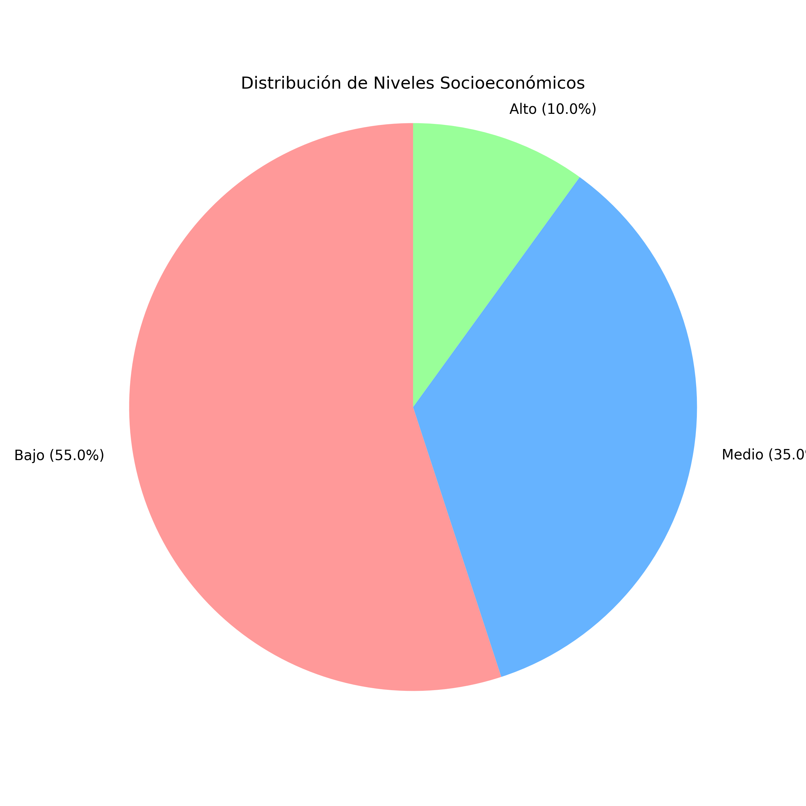
- **Analysis:** Pie chart showing socioeconomic levels: 55% "Bajo", 35% "Medio", 10% "Alto". Suggests limited access to higher-income healthcare services.
- **Good:** Highlights socioeconomic disparities.

#### **13. Gender Distribution (`gender_distribution.png`)**
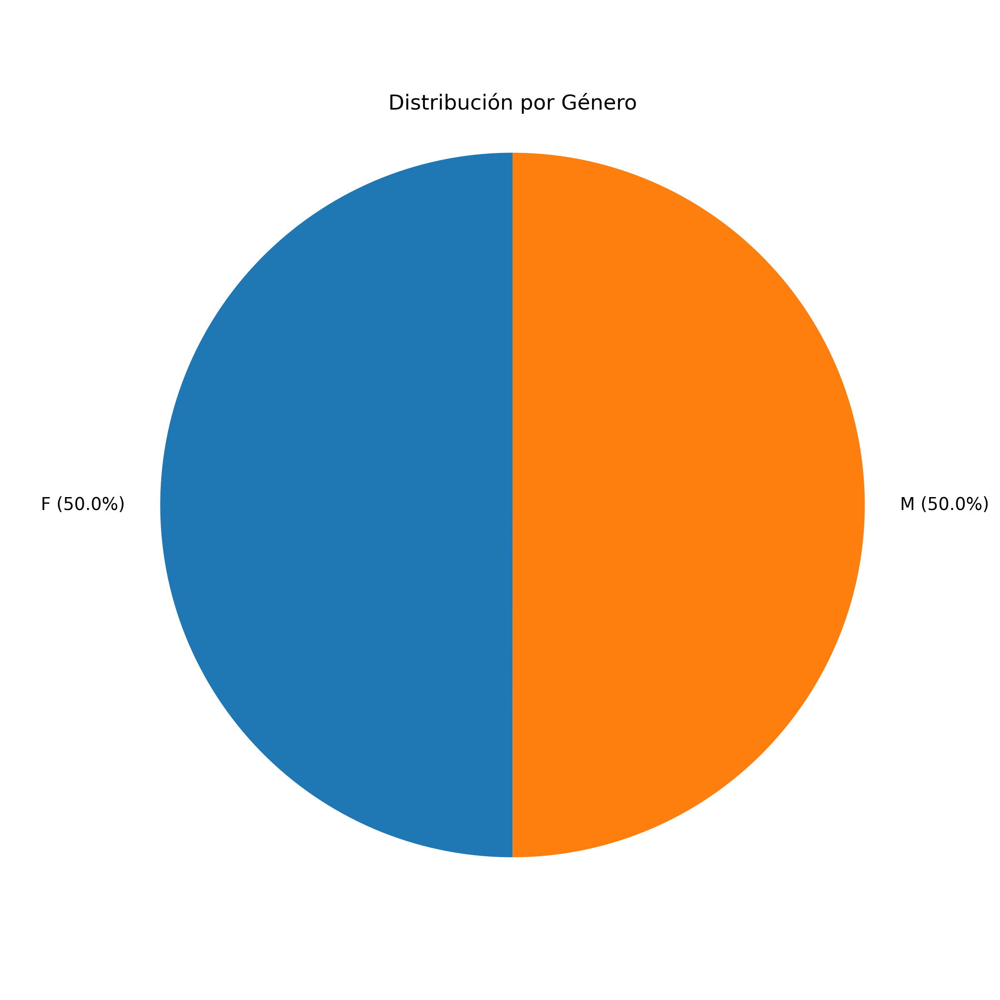
- **Analysis:** Pie chart showing gender: 50% male, 50% female. Indicating balanced representation.
- **Good:** Gender balance aligns with population norms.

### Errors Detected
- **Unrealistic Values:**
  - Unrealistic weights (<20kg or >150kg): 55560 rows
  - Unrealistic BMI (<10 or >50): 112437 rows
  - Blood pressure deviating from formula: 2115714 rows
  - Ages: No ages <0 or >120, but dataset range (15-100) is limited.
  - Duplicate IDs: 125 rows
  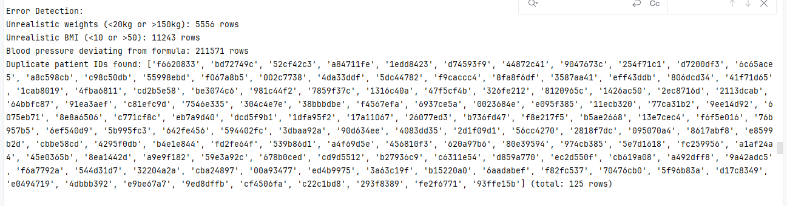
  - Heights: No values <50 cm or >250 cm.
- Future Dates: No future datas found.
- No Errors in IMC formula: All BMI values were correctly formatted.

### General Analysis

The dataset provides a realistic snapshot of medical records in Bogotá, with 10,000,000 patients aged 15-100, balanced gender distribution, and socioeconomic skew towards "Bajo" (55%). Key findings:

- **Health Trends:** High prevalence of "Z00.0 - Examen médico general" (13.6%) indicates frequent checkups.
- **Demographics:** Age distribution is slightly right-skewed (mean ~35 years), reflecting a younger population. Men are heavier and taller than women.
- **Socioeconomic Impact:** The predominance of "Bajo" socioeconomic status may indicate limited access to healthcare, potentially affecting chronic disease reporting.
- **Hospital Load:** All hospitals are equally consulted
- **Data Quality:** Errors like unrealistic weights/BMI suggest data generation issues. Duplicate IDs indicate potential record-keeping errors.


### Test Coverage

The `test_medical_data_analysis.py` file achieves >90% coverage for `medical_data_analysis.py`, with tests covering:
- Data parsing and validation (`parse_blood_pressure`, `clean_and_validate_data`).
- All visualization functions (`plot_*`).
- Edge cases (e.g., single-gender data, invalid values).

Coverage report:
```
Name                            Stmts   Miss  Cover
---------------------------------------------------
medical_data_analysis.py          308     11    96%
test_medical_data_analysis.py     110      0   100%
---------------------------------------------------
TOTAL                             418     11    97%
```


### Creating the Visualizations

To generate the visualizations, follow these steps:

1. Ensure dependencies are installed:
   ```bash
   pip install pandas numpy matplotlib seaborn scipy
   ```

2. Run the analysis script:
   ```bash
   python medical_data_analysis.py
   ```
   This processes `data014_big.csv` and generates several plots.

3. Review the generated PNG files in the working directory.

### Conclusions

This project successfully analyzes a synthetic medical dataset, identifying health trends (e.g., BMI-disease correlations), demographic patterns (e.g., age distribution), and errors. The several visualizations provide a comprehensive view of the data, highlighting strengths like gender balance and realistic health patterns, but also weaknesses like under-reported chronic conditions and socioeconomic skew. With >90% test coverage, the analysis is reliable, though data quality issues suggest improvements in data generation for future iterations. The project demonstrates proficiency in data cleaning, visualization, and error detection, making it a valuable tool for studying healthcare dynamics in Bogotá.

### Instructions to Run the Project

1. Clone the repository from GitHub.
2. Install the listed dependencies.
3. Place `data014_big.csv` in the working directory.
4. Run the analysis with `python medical_data_analysis.py`.
5. Run tests with `coverage run -m unittest test_medical_data_analysis.py`.
6. See coverage report with `coverage report -m`.
7. Review the generated visualizations in the working directory.